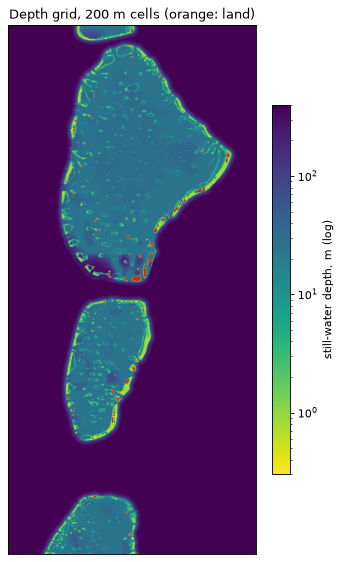
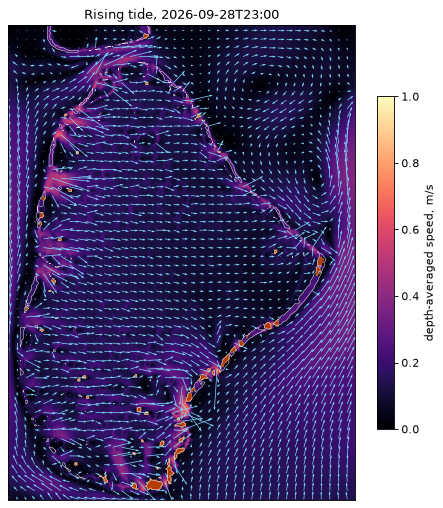
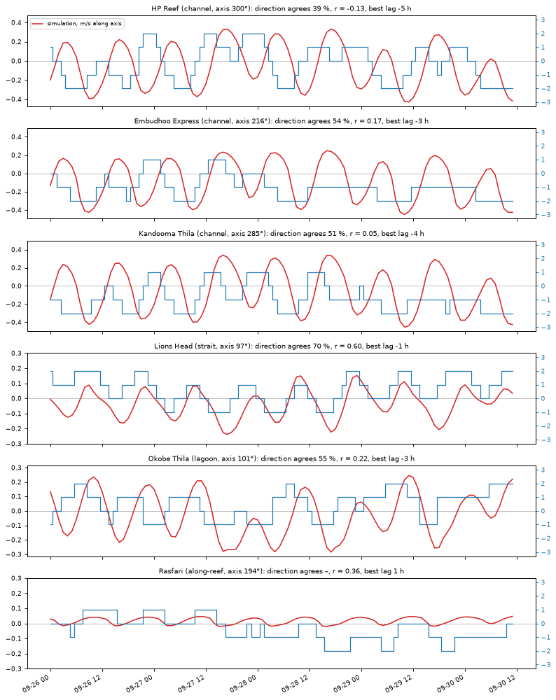

# Shallow-water simulation of North and South Malé (research prototype)

A depth-averaged hydrodynamic simulation of North Malé, South Malé, Vaadhoo Kandu between them and the sea round
them, with the islands and shallow reefs in it, run over 18 Sep – 2 Oct 2026 (a spring–neap cycle) on live Open-Meteo levels and compared
site by site with the forecast the app showed for the same ocean. It is offline research: nothing here feeds the
forecast, the model version is unchanged, and CI does not run it.

North and South Malé were picked together: North Malé has the most dive sites (77), South Malé (33) holds the only
benchmark fixtures that fall in a recent window, and the strait between them is where the app runs its hand-set
strait model. One domain covers 110 sites.

## What it does

- **Grid** (`grid.py`): 200 m cells, 663 × 311, about 133 × 62 km. Three sources, finest first:
  - **Islands:** land from the open terrarium elevation tiles on AWS at zoom 12 (about 38 m a pixel). 656 cells.
  - **Reefs:** the Allen Coral Atlas reef zones already exported to `public/overlays/reef-zones`, each zone given a
    typical depth (`ZONE_DEPTH_M`: reef crest 0.4 m, flats 0.6–0.8 m, slopes 6–12 m, lagoon patches 3–12 m).
  - **Everything else:** the terrarium sea floor at zoom 10 (ETOPO/GEBCO class, about 1–2 km underneath). It smooths
    the rims into banks and fills Vaadhoo Kandu to 25–100 m, so open water inside an atoll outline is held at least
    25 m deep (channels, lagoon floor) and outside it falls away from the reef at 0.3 m per m to 400 m (Vaadhoo
    Kandu is 5 km wide and 400 m deep per `data/sites.json`).
  - Each cell averages 4 × 4 subcells of 50 m. 
- **Solver** (`swe.py`): the nonlinear shallow-water equations on a C-grid, explicit (1.5 s step), upwind
  advection, Manning friction (n = 0.035 on reef crest and flats, 0.025 elsewhere), Coriolis, wetting and drying of
  reef flats, islands as walls. Numba, about 12 s per simulated hour on 4 cores.
- **Forcing** (`forcing.py`, `marine.py`): Open-Meteo sea level over `domain.WINDOW` (15 days, 18 Sep – 2 Oct),
  fetched the way the app fetches it (nearest sea cell, Maldives wall clock) and cached in `sim/cache/marine/`.
  - Every ocean-model cell (1/12°) along each open edge, 16 a side from the south wall to the north wall: the inner
    sea at 73.21° E and the open ocean at 73.79° E. The solver interpolates each edge's level in latitude, so it
    varies along the edge as the ocean model's does (up to 0.11–0.12 m from end to end).
  - The inner sea runs up to ±0.17 m off the ocean through the tide (std 0.07 m), the two within an hour of each other:
    the tide crosses the double chain of atolls with a lag, and that head across the chain is the second driver.
    The 15-day mean head is +0.8 cm (inner sea higher).
  - The north and south edges are walls drawn through Gaafaru and Vaavu, so that head drops across the atolls and
    the gaps between them instead of running round the domain's ends.
  - Only levels are imposed; every current inside comes from the levels, the depths and friction. The ocean model's
    current is not imposed (forcing it at the edges pushes the whole drift against a chain that blocks the section).
- **Cases** (`SIM_CASE`): `chain` drives the edges as above; `uniform` gives both edges the east level, leaving
  only the tide's rise and fall, to separate the two drivers; `open` is `chain` with the north and south edges open
  to the ocean model's levels too, so the tidal stream along the chain runs through. `chain` and `open` were run on
  the live levels.
- **Comparison** (`npm run sim-compare`, `scripts/sim-compare.ts`): runs `loadSite` for every site with Open-Meteo
  stubbed by the same window's live series, each point the forecast asks for (seaward sample points, the atoll
  ring points) getting its own ocean-model cell, so the forecast's head term sees what it would have seen live. The
  simulated current at the nearest open-water cell to each pin is projected on the axis the app shows for the site.
  Hours: 19 Sep 00:00 to 2 Oct 11:00 (the first day is spin-up; the forecast has no 25-hour mean in its last 12 h).
- **Run time:** about 12 s a simulated hour on 4 cores, so 15 days take 75 minutes. `swe.py` checkpoints every
  simulated day and resumes from it, for longer windows.

## Findings (chain case, 18 Sep – 2 Oct, live levels)

Fifteen days cover a full spring–neap cycle: neaps on 19–22 Sep (ocean tide range 0.25–0.35 m a day), springs on
27 Sep – 1 Oct (0.9–1.06 m).

| Kind | Sites | Direction agrees* | Correlation | Best lag (h)† | Sim p95 speed | Sim hours in | Forecast hours in |
|---|---|---|---|---|---|---|---|
| Channel | 44 | 73 % | 0.42 | −2 | 0.35 m/s | 37 % | 24 % |
| Along the reef | 25 | 77 % | 0.20 | +1 | 0.13 m/s | 32 % | 50 % |
| Lagoon | 34 | 69 % | 0.18 | −2 | 0.22 m/s | 63 % | 87 % |
| Strait wall | 7 | 71 % | 0.40 | −2 | 0.34 m/s | 66 % | 94 % |

\* Of the hours both call non-slack. † Median over sites; negative means the simulation turns that many hours
*after* the forecast (the forecast at hour t lines up best with the simulation at t + |lag|). The first write-up of
this table read the sign the other way round. The semidiurnal tide repeats every 12.4 h, so a lag near ±6 h is close
to half a tide either way. Full per-site output: `sim/out/chain/compare.txt` after a run.

How the picture moved with the forcing and the window:

| Run | Forcing | Channels agree | Correlation | Lag |
|---|---|---|---|---|
| 25–30 Sep | cached, one inner-sea point | 58 % | 0.03 | −4 h |
| 23 Sep – 2 Oct | live, 16 points a side | 68 % | 0.30 | −2 h |
| 18 Sep – 2 Oct | live, 16 points a side | 73 % | 0.42 | −2 h |

1. **Across most of both atolls the simulation turns about 2 h after the forecast.** West-rim channels (Kuda, Bodu
   Hithi, Ziyaarai, Madi Thila; Vaagili, Ran Faru, Ramm Faru, Lhohi, Rannalhi) agree 68–96 % of hours and correlate
   0.7–0.85 at that lag. North Malé's east rim (HP Reef, Furana Thila and North, Lankan Caves) now does the same
   (78–81 %, lag −2 h); in the 10-day run it looked 3 h later.
2. **South Malé's east rim is the clearest disagreement.** Kandooma, Embudhoo, Dhigu, Medhu Faru, Cocoa, Guraidhoo,
   Sundune and Lhosfushi: the simulation runs them incoming 34–38 % of hours, the forecast 7–14 %. They agree
   66–79 %, and the simulation turns 3–5 h after the forecast. The head term (τ = 0.25 h) holds them outgoing.
3. **North Malé's north-east corner runs nearly half a tide out.** Furana South, Club Med Corner, Vah Kandu, Kagi
   Kandu, Helengeli, Miyaru and Prisca correlate −0.5 to +0.3 at lag 0 and 0.5–0.75 only 3–5 h the other way.
   They face the gap to Gaafaru, where the edge level varies along the chain. Held across both runs.
4. **The forecast agrees better at neaps than at springs.** Channels agree 80 % of hours over 18–25 Sep (neaps) and
   66 % over 26 Sep – 2 Oct (springs): the disagreements above are larger when the current is strongest.
5. **Strait walls agree 71 %, the simulation about 2 h behind.** The forecast makes them east 91–95 % of hours, the
   simulation 43–77 %. Its speeds (p95 0.2–0.5 m/s) stay below the owner's 0.8–1.2 m/s.
6. **Walls along the reef and lagoon sites** agree 77 % and 69 %, but correlate only 0.2: the simulation has no real
   along-chain stream (p95 0.13 m/s at walls), and the forecast runs the lagoon incoming 87 % of hours against 63 %.
7. **Benchmark fixtures:** the 10 scored curated reports at Kandooma Thila and Embudhoo Express on 27 Sep all disagree
   with the simulation. They are scenarios written from the tide, not dives.
8. **The monsoon drift is already in the levels.** The ocean model's levels carry a mean head of +0.8 cm across the
   chain, and in the simulation that alone drives 0.14–0.22 m/s east through Vaadhoo Kandu on average, as much as
   the ocean model's own drift there (0.14 m/s; `drift_calibrate.py` gives about 0.05 m of steady head per m/s of
   strait current). Adding the drift on top would count it twice. The simulation already runs the west rims in
   on average (Kuda +0.09, Vaagili +0.15 m/s) and the east rims out (Kandooma −0.08, Embudhoo −0.10, Dhigu −0.19 m/s).
   What differs is the balance: there the tide (±0.13–0.20 m/s) outweighs that mean about a third of the time,
   while the forecast lets the monsoon terms hold the east rims outgoing almost throughout.
9. **The tidal stream along the chain changes nothing at the sites.** The "open" case opens the north and south
   edges to the ocean-model levels along them (8 points a side), and up to 6 × 10⁶ m³/s now runs through the domain's
   ends instead of 0.7. Yet every channel group scores the same as with walls (same direction agreement, same lags,
   same share of hours incoming); walls along the reef move a little more (p95 0.13 → 0.15 m/s, correlation 0.20 →
   0.26). The stream runs past the atolls in deep water and does not reach the channels. North Malé's north-east
   corner stays nearly half a tide out (lags +3 to +6 h), so the closed ends were not the cause, and the stream gives
   no reason to add a term for it to the channel forecast.

 

## How far to trust it

- **No ground truth.** Both models are judged against each other. Real dive reports are what decide.
- **One spring–neap cycle.** Fifteen days in the SW monsoon; a 90-day run would show whether the lags hold
  through the season.
- **The forcing is the ocean model's.** Levels from an 8 km model that does not resolve the atolls. If it gets the
  lag across the chain wrong, the east-rim phase moves with it.
- **The rim's openings are guessed.** Gaps between mapped reef are held 25 m deep. Speeds scale with the opening
  area: fewer or shallower openings mean faster channels. Real sill depths per channel would sharpen this most.
- **200 m cells** blur channels narrower than about 400 m and thilas; a pin often samples a cell 50–150 m away.
- **Depth-averaged**, no wind, no waves, no ocean drift imposed; the strait's 400 m cap is real, the ocean's is not.

## What it could become

- A longer window (90 days for a season) is a change to `domain.WINDOW`; about 12 s a simulated hour.
- Fit, per site, the simulated along-axis current to the ocean slope and the west–east head (a gain and a lag each).
  That would give the live model per-site constants grounded in physics without running a simulation in the app.
- Finer nests (50 m) round the dive-heavy rims, with sill depths from charts or the owner.

## Running it

```bash
python3 -m pip install -r sim/requirements.txt
python3 sim/fetch_terrain.py              # 113 tiles into sim/cache/ (gitignored)
python3 sim/grid.py                       # sim/out/grid.npz
python3 sim/forcing.py                    # fetches the edge levels into sim/cache/marine/
python3 sim/swe.py && python3 sim/export.py    # about 75 min for 15 days
npm run sim-compare                       # prints the tables, writes sim/out/chain/compare.json; fetches the
                                          # forecast's own sample points with curl if not cached
python3 sim/plot.py                       # sim/figures/
# the uniform-tide case: prefix each of forcing, swe, export, sim-compare and plot with SIM_CASE=uniform
# behind a proxy with its own CA, point Python at it: SSL_CERT_FILE=/path/to/ca.crt python3 sim/forcing.py
```
